# Directory

- [Directory](#directory)
  - [1. Apply for APP ID and Ad Unit ID on ZPLAY Ads platform](#1-apply-for-app-id-and-ad-unit-id-on-zplay-ads-platform)
    - [1.1 Click *ADD NEW APP* button in Application Management page](#11-click-add-new-app-button-in-application-management-page)
    - [1.2 Fill in app information, and click *Save* button, then go back to Application Management](#12-fill-in-app-information-and-click-save-button-then-go-back-to-application-management)
    - [1.3 Obtain your APP ID in Application Management page](#13-obtain-your-app-id-in-application-management-page)
    - [1.4 Click *ADD NEW ADUNIT* button in app list, or you are also available to do this in AdUnit Management page](#14-click-add-new-adunit-button-in-app-list-or-you-are-also-available-to-do-this-in-adunit-management-page)
    - [1.5 Fill in adunit information, and click *Save* button, then go back to AdUnit Management](#15-fill-in-adunit-information-and-click-save-button-then-go-back-to-adunit-management)
    - [1.6 Obtain your adunit ID in AdUnit Management page](#16-obtain-your-adunit-id-in-adunit-management-page)
  - [2. Add MoPub SDK and ZPLAY Ads SDK as below](#2-add-mopub-sdk-and-zplay-ads-sdk-as-below)
    - [2.1 Add android project dependency](#21-add-android-project-dependency)
    - [2.2 Add MoPub-used components in Manifest file](#22-add-mopub-used-components-in-manifest-file)
  - [3. Add the following files into project](#3-add-the-following-files-into-project)
  - [4. Set up ad unit for ZPLAY Ads on MoPub](#4-set-up-ad-unit-for-zplay-ads-on-mopub)
    - [4.1 Create new adunit for ZPLAY Ads](#41-create-new-adunit-for-zplay-ads)
    - [4.2 Obtain the existed adunit ID](#42-obtain-the-existed-adunit-id)
  - [5. Add ZPLAY Ads as a new network on MoPub](#5-add-zplay-ads-as-a-new-network-on-mopub)
    - [5.1 Open Networks page, click *New network* button](#51-open-networks-page-click-new-network-button)
    - [5.2 Click *Custom SDK Network* link](#52-click-custom-sdk-network-link)
    - [5.3 Set up the title as ZPLAY Ads Network, and configure ZPLAY Ads in the adunits which were applied in step 3(image 1 and 2)](#53-set-up-the-title-as-zplay-ads-network-and-configure-zplay-ads-in-the-adunits-which-were-applied-in-step-3image-1-and-2)
  - [6. Turn on ZPLAY Ads network on MoPub](#6-turn-on-zplay-ads-network-on-mopub)
    - [6.1 Open Segments page, and click Global Segment](#61-open-segments-page-and-click-global-segment)
    - [6.2 Find the app and adunit which have been integrated to ZPLAY Ads（as the MediationMopub in screenshot below), turn on ZPLAY Ads network(as the turn on button in screenshot below)](#62-find-the-app-and-adunit-which-have-been-integrated-to-zplay-adsas-the-mediationmopub-in-screenshot-below-turn-on-zplay-ads-networkas-the-turn-on-button-in-screenshot-below)
  - [7. Confirm the configuration of ZPLAY Ads](#7-confirm-the-configuration-of-zplay-ads)
  - [8. Use MoPub to request ZPLAY Ads in project](#8-use-mopub-to-request-zplay-ads-in-project)
  - [9. Test](#9-Test)


## 1. Apply for APP ID and Ad Unit ID on ZPLAY Ads platform

### 1.1 Click *ADD NEW APP* button in [Application Management](https://sellers.zplayads.com/#/app/appList/) page

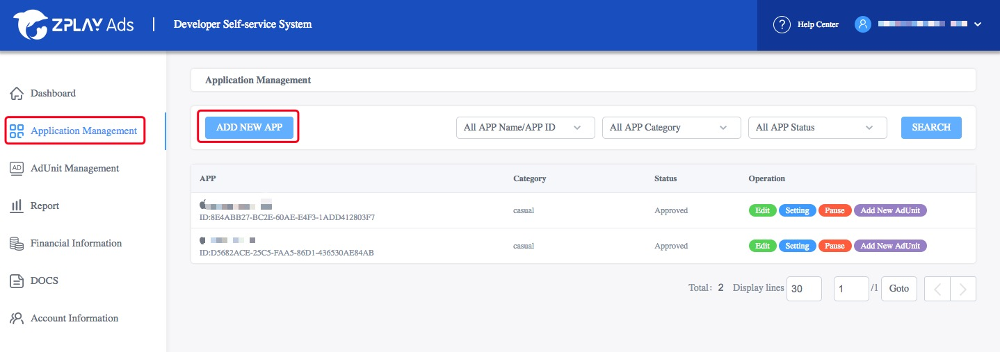

### 1.2 Fill in app information, and click *Save* button, then go back to Application Management

a. If your APP is launched in Google Play, you can fill in package name to get APP information
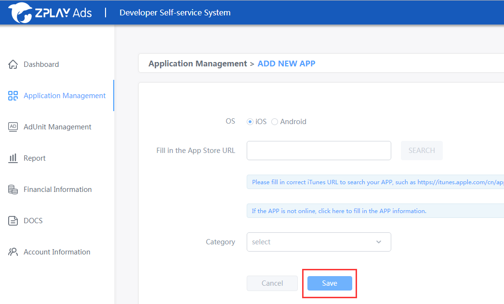

b. If your APP has not launched in Google Play, or launched in non Google Play store, you should fill in APP information manually
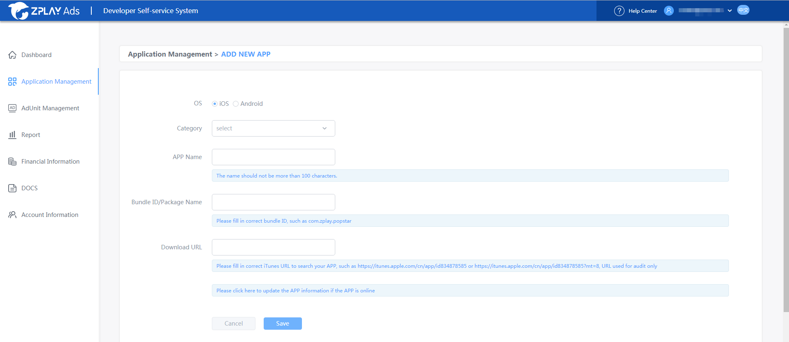

### 1.3 Obtain your APP ID in Application Management page

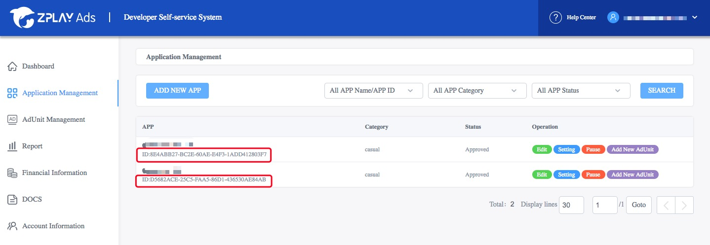

### 1.4 Click *ADD NEW ADUNIT* button in app list, or you are also available to do this in [AdUnit Management](https://sellers.zplayads.com/#/ad/placeList/) page

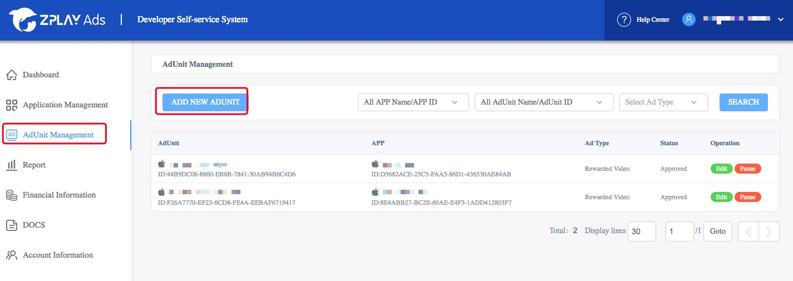

### 1.5 Fill in adunit information, and click *Save* button, then go back to AdUnit Management

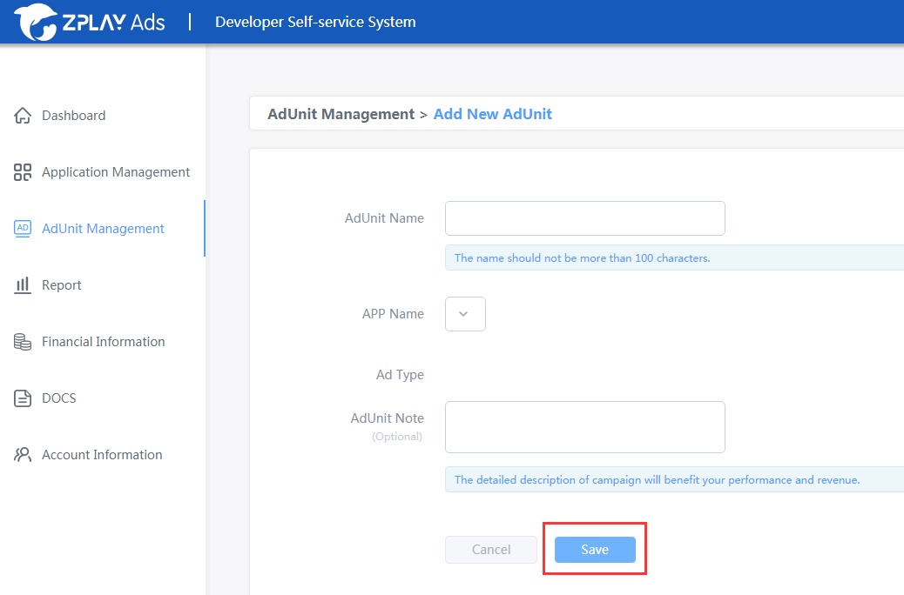

### 1.6 Obtain your adunit ID in AdUnit Management page

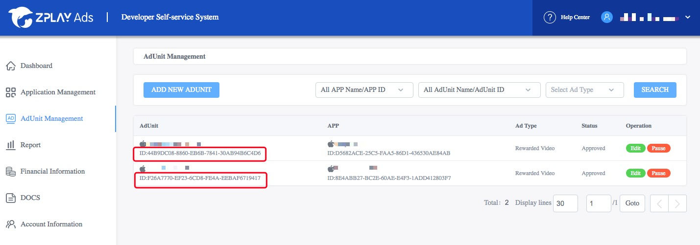

Note: You are available to use the following ID when testing(not charge). Please switch to the ID you applied in production mode.

| OS      | Ad_Type        | App_ID                               | Ad_Unit_id                           |
| ------- | -------------- | ------------------------------------ | ------------------------------------ |
| Android | Rewarded video | 5C5419C7-A2DE-88BC-A311-C3E7A646F6AF | 3FBEFA05-3A8B-2122-24C7-A87D0BC9FEEC |
| Android | Interstitial   | 5C5419C7-A2DE-88BC-A311-C3E7A646F6AF | 19393189-C4EB-3886-60B9-13B39407064E |

## 2. Add MoPub SDK and ZPLAY Ads SDK as below

### 2.1 Add android project dependency

```java
dependencies {
    ...
    // ZPLAY Ads dependency
    compile 'com.playableads:playableads:2.4.1'
    // Mopub dependency
    compile('com.mopub:mopub-sdk:5.6.0@aar') {
        transitive = true
    }
}
```

### 2.2 Add MoPub-used components in Manifest file

```java
<application>
    <activity
        android:name="com.mopub.mobileads.MoPubActivity"
        android:configChanges="keyboardHidden|orientation|screenSize" />
    <activity
        android:name="com.mopub.mobileads.MraidActivity"
        android:configChanges="keyboardHidden|orientation|screenSize" />
    <activity
        android:name="com.mopub.common.MoPubBrowser"
        android:configChanges="keyboardHidden|orientation|screenSize" />
    <activity
        android:name="com.mopub.mobileads.MraidVideoPlayerActivity"
        android:configChanges="keyboardHidden|orientation|screenSize" />
    <activity
        android:name="com.mopub.mobileads.RewardedMraidActivity"
        android:configChanges="keyboardHidden|orientation|screenSize" />
</application>
```

## 3. Add the following files into project

1. Reward video adapter: [ZPLAYAdsRewardedVideo.java](./app/src/main/java/com/zplay/playable/mediationmopub/ZPLAYAdsRewardedVideo.java)

2. Interstitial adapter: [MPZPLAYAdsInterstitial.java](./app/src/main/java/com/zplay/playable/mediationmopub/MPZPLAYAdsInterstitial.java)


Please ensure no errors after classes imported. Then record the path of package, e.g (com.zplay.playable.mediationmopub.ZPLAYAdsRewardedVideo) which is used to configure ZPLAYAds on MoPub.

This document only shows how to configure RewardVideo adapter, you can configure the interstitial adapter by the same way.

## 4. Set up ad unit for ZPLAY Ads on [MoPub](https://app.mopub.com/apps)

### 4.1 Create new adunit for ZPLAY Ads

- a. Choose your app, click *New ad unit* button

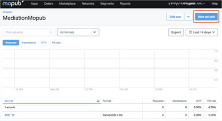

- b. Choose Rewarded video or Fullscreen when creating adunit, then click *Save* button, take Rewarded video as an example here

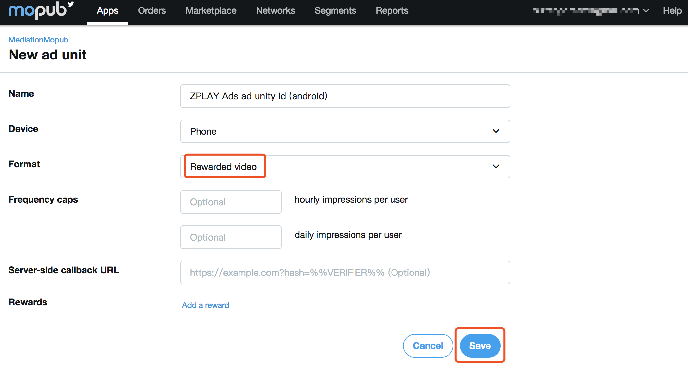

- c. Obtain the new adunit ID

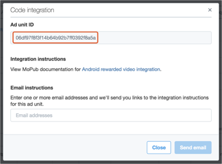

### 4.2 Obtain the existed adunit ID

- a. Choose your APP and enter adunit list. Click the adunit, and click *Edit an unit*, then choose *View code integration* button.

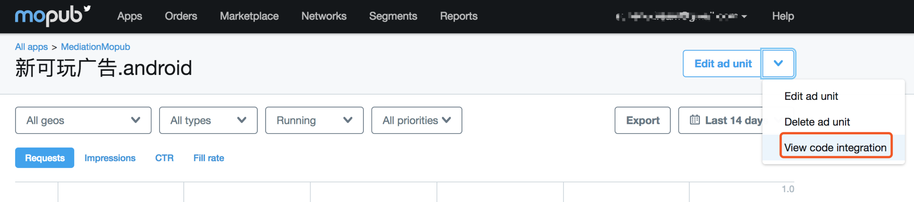

- b. Obtain the adunit ID

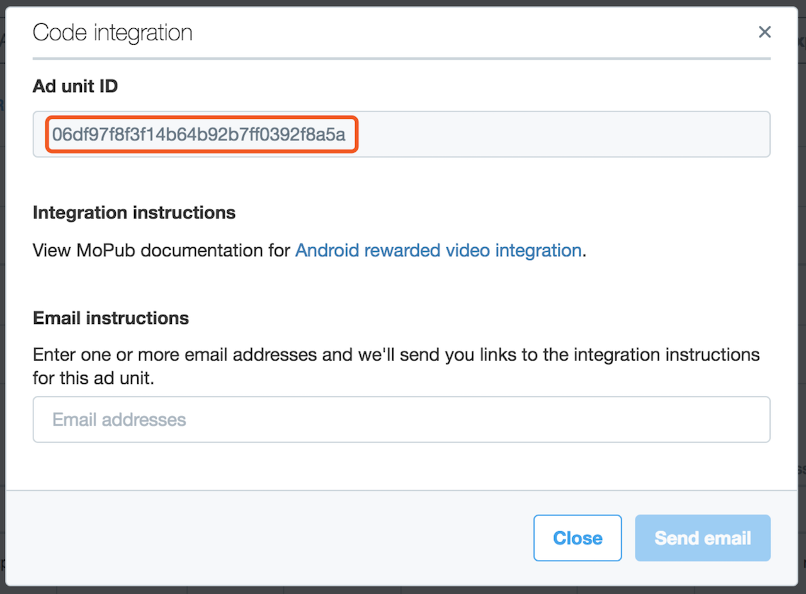

## 5. Add ZPLAY Ads as a new network on [MoPub](https://app.mopub.com/networks)

### 5.1 Open Networks page, click *New network* button

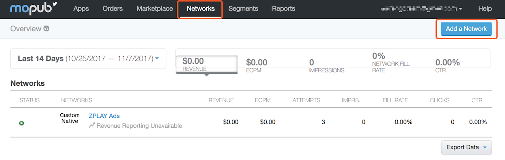

### 5.2 Click *Custom SDK Network* link


### 5.3 Set up the title as ZPLAY Ads Network, and configure ZPLAY Ads in the adunits which were applied in step 3(image 1 and 2)

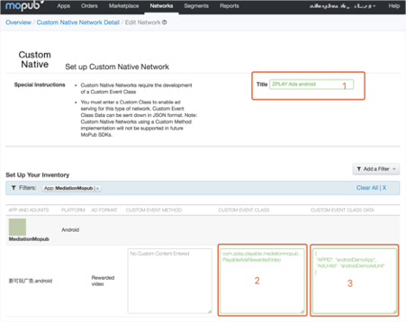
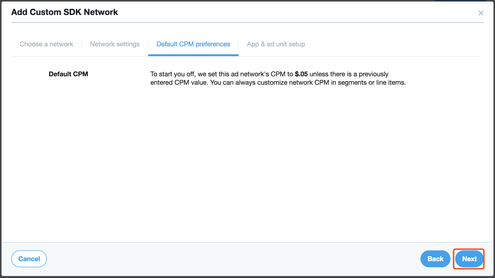
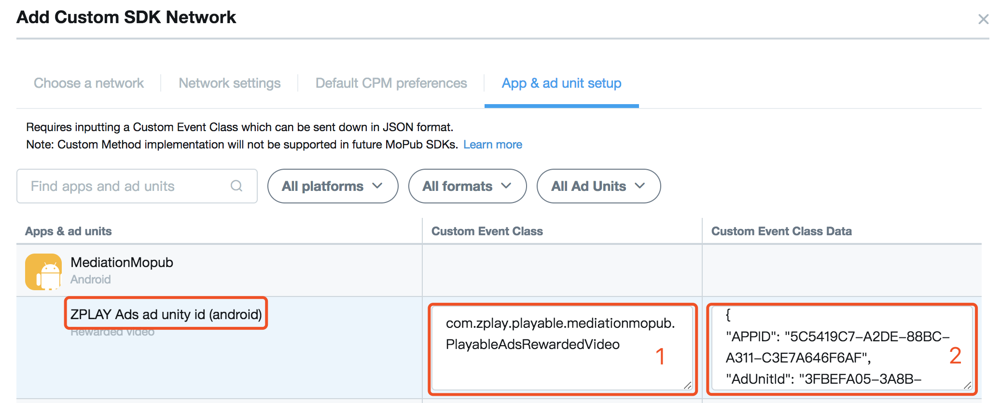

- a. Add the followings code to mark 1 of above image:

```java
com.zplay.playable.mediationmopub.ZPLAYAdsRewardedVideo
```

> Note:Please fill in the existed position of ZPLAYAdsRewardedVideo in project.

- b. Add the adunits you applied on ZPLAY Ads Platform to mark 2 of above image as the following format:

```java
{
    "APPID": "5C5419C7-A2DE-88BC-A311-C3E7A646F6AF",
    "AdUnitId": "3FBEFA05-3A8B-2122-24C7-A87D0BC9FEEC"
}
```

> Note: Please remember to change test APP ID "5C5419C7-A2DE-88BC-A311-C3E7A646F6AF" to the APP ID you applied on ZPLAY Ads Platform, and change test Ad Unit ID "3FBEFA05-3A8B-2122-24C7-A87D0BC9FEEC" to the Ad Unit ID you applied on ZPLAY Ads Platform.

## 6. Turn on ZPLAY Ads network on [MoPub](https://app.mopub.com/segments)

### 6.1 Open Segments page, and click Global Segment

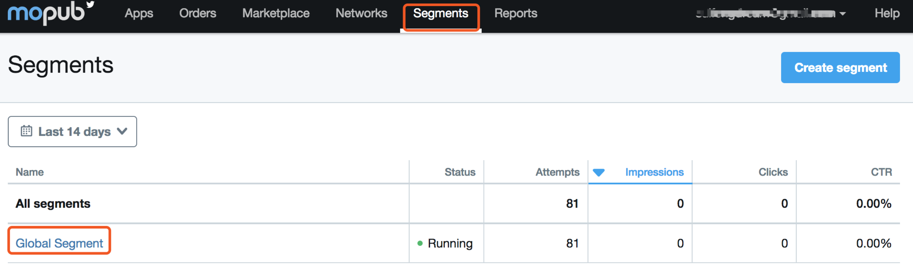

### 6.2 Find the app and adunit which have been integrated to ZPLAY Ads（as the MediationMopub in screenshot below), turn on ZPLAY Ads network(as the turn on button in screenshot below)

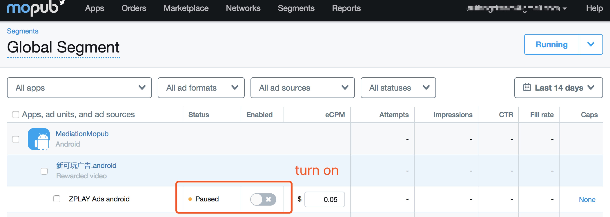

## 7. Confirm the configuration of ZPLAY Ads

After step 6.2, the ZPLAY Ads network has been available already. Enter AdUnit Management page, the ad sources list will be shown as below if configuration is successful. If not, please check the setting according to the previous steps.

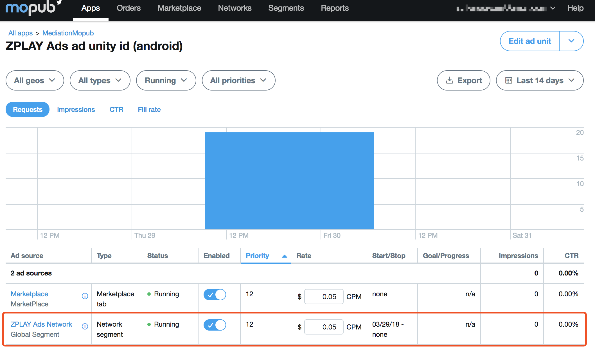

## 8. Use MoPub to request ZPLAY Ads in project

You can get more code samples from ZPLAY Ads Demo. The main files work as follows:

As for [MainActivity](./app/src/main/java/com/zplay/playable/mediationmopub/MainActivity.java), you can learn how to initialize mopub sdk as the mopub's [document](https://developers.mopub.com/docs/android/initialization/) said.

[RewardedVideoActivity](./app/src/main/java/com/zplay/playable/mediationmopub/RewardedVideoActivity.java) is a rewarded video sample code. When you get your mopub an unitID, and make sure the [adapter](./app/src/main/java/com/zplay/playable/mediationmopub/ZPLAYAdsRewardedVideo.java) in your project, you will get rewarded video from ZPLAY Ads.

## 9. Test
You are available to use the following ID when testing(not charge). Please switch to the ID you applied in production mode.

| OS      | Ad_Type        | App_ID                               | Ad_Unit_id                           |
| ------- | -------------- | ------------------------------------ | ------------------------------------ |
| Android | Rewarded video | 5C5419C7-A2DE-88BC-A311-C3E7A646F6AF | 3FBEFA05-3A8B-2122-24C7-A87D0BC9FEEC |
| Android | Interstitial   | 5C5419C7-A2DE-88BC-A311-C3E7A646F6AF | 19393189-C4EB-3886-60B9-13B39407064E |
