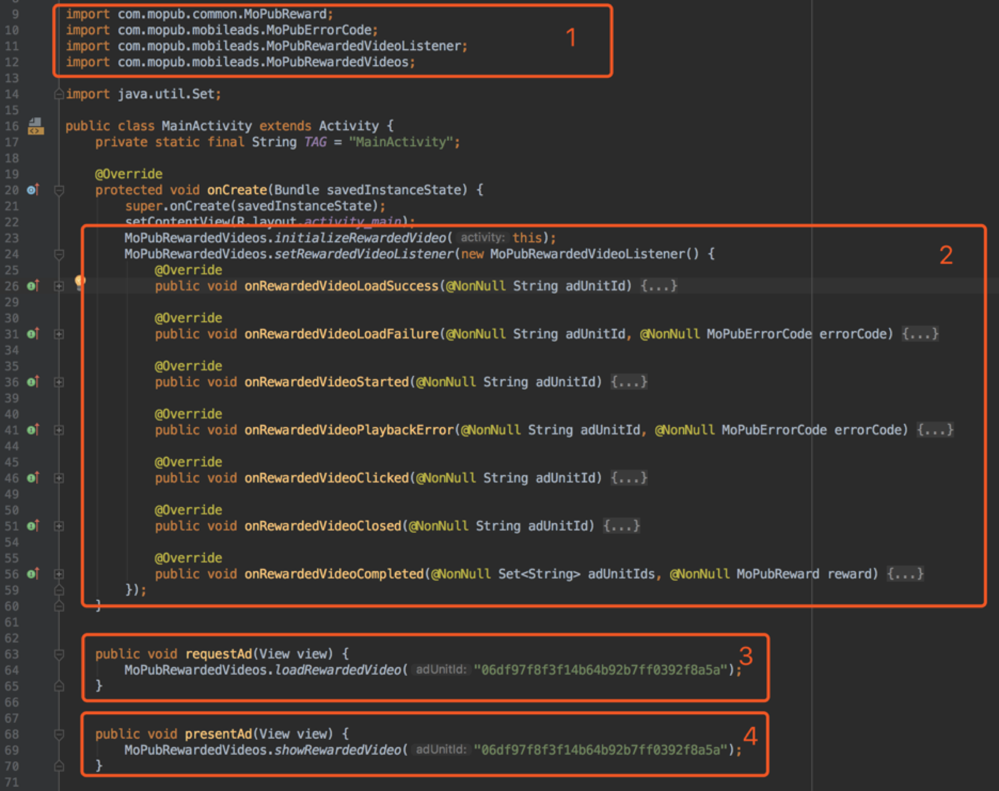
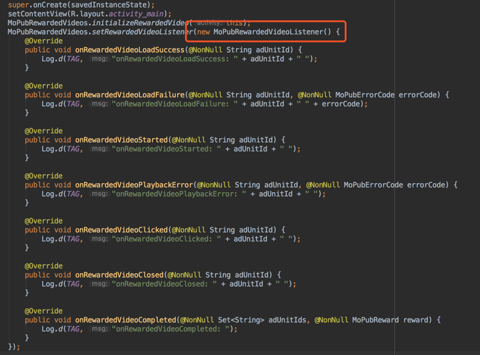

## Directory
1. Apply for app ID and ad unit ID on ZPLAY Ads platform
2. Add MoPub SDK and ZPLAY Ads SDK
3. Add the following files into project
4. Set ad unit for ZPLAY Ads on MoPub
5. Add ZPLAY Ads as a new network on MoPub 
6. Turn on ZPLAY Ads network on MoPub
7. Confirm the configuration of ZPLAY Ads
8. Use MoPub to request ZPLAY Ads in project
9. Debugging

---

## 1. Apply for app ID and ad unit ID on ZPLAY Ads platform
### 1.1 Click *ADD NEW APP* button in Application Management page


### 1.2 Fill in app information, and click *ADD* button, then go back to Application Management


### 1.3 Obtain your app ID in Application Management page


### 1.4 Click *Add New AdUnit* button in app list, or you are also available to do this in AdUnit Management page


### 1.5 Fill in adunit information, and click *ADD* button, then go back to AdUnit Management


### 1.6 Obtain your adunit ID in AdUnit Management page


Note: You are available to use the following ID when testing(not charge). Please switch to the ID you applied in production mode.

|OS|Ad_Type|  App_ID  |  Ad_Unit_id|
|--------|---|----------|------------|
|Android|Rewarded video|5C5419C7-A2DE-88BC-A311-C3E7A646F6AF|3FBEFA05-3A8B-2122-24C7-A87D0BC9FEEC|
|Android|Interstitial|5C5419C7-A2DE-88BC-A311-C3E7A646F6AF|19393189-C4EB-3886-60B9-13B39407064E|

## 2. Add MoPub SDK and ZPLAY Ads SDK as below:
```
dependencies {
    ...
    // ZPLAY Ads dependency
    compile 'com.playableads:playableads:2.0.5'
    // Mopub dependency
    compile('com.mopub:mopub-sdk:4.20.0@aar') {
        transitive = true
    }
}
```
### 2.1 Add android project dependency


### 2.2 Add MoPub-used components in Manifest file
```
<application>
    <activity
        android:name="com.mopub.mobileads.MoPubActivity"
        android:configChanges="keyboardHidden|orientation|screenSize" />
    <activity
        android:name="com.mopub.mobileads.MraidActivity"
        android:configChanges="keyboardHidden|orientation|screenSize" />
    <activity
        android:name="com.mopub.common.MoPubBrowser"
        android:configChanges="keyboardHidden|orientation|screenSize" />
    <activity
        android:name="com.mopub.mobileads.MraidVideoPlayerActivity"
        android:configChanges="keyboardHidden|orientation|screenSize" />
    <activity
        android:name="com.mopub.mobileads.RewardedMraidActivity"
        android:configChanges="keyboardHidden|orientation|screenSize" />
</application>
```


## 3. Add the following files into project
[ZPLAYAdsRewardedVideo.java](app/src/main/java/com/zplay/playable/mediationmopub/ZPLAYAdsRewardedVideo.java)
Please ensure no errors after classes imported. Then record the path of package, e.g （com.zplay.playable.mediationmopub.ZPLAYAdsRewardedVideo）, which is used to configure ZPLAYAds on MoPub.

## 4. Set ad unit for ZPLAY Ads on MoPub 
### 4.1 Create new adunit for ZPLAY Ads
- a. Choose your app, click *New ad unit* button


- b. Choose Rewarded video or Fullscreen when creating adunit, then click *Save* button, take Rewarded video as an example here

 

- c. Obtain the new adunit ID


### 4.2 Obtain the existed adunit ID
- a. Choose your app and enter adunit list.Click the adunit, and click *Edit an unit*, then choose *View code integration* button.


- b. Obtain the adunit ID


## 5. Add ZPLAY Ads as a new network on MoPub
### 5.1 Open Networks page, click *New network* button


### 5.2 Click *Custom SDK Network* link


### 5.3 Set the title as ZPLAY Ads Network, and configure ZPLAY Ads in the adunits which were applied in step 3(image 1 and 2).


- a. Add the followings to image 1:
```
com.zplay.playable.mediationmopub.ZPLAYAdsRewardedVideo
```

(Note:Please fill in the existed position of ZPLAYAdsRewardedVideo in project.)

- b. Add the adunits you applied on ZPLAY Ads to image 2 as the following format:
```
{
    "APPID": "5C5419C7-A2DE-88BC-A311-C3E7A646F6AF",
    "AdUnitId": "3FBEFA05-3A8B-2122-24C7-A87D0BC9FEEC"
}
```
Note: If necessary, please view step 1.3 to know how to change 5C5419C7-A2DE-88BC-A311-C3E7A646F6AF to the APPID you applied on ZPLAY Ads, and view step 1.6 to find the way to change 3FBEFA05-3A8B-2122-24C7-A87D0BC9FEEC to AdUnitId applied on ZPLAY Ads.

## 6. Turn on ZPLAY Ads network on MoPub
### 6.1 Open Segments page, and click Global Segment


### 6.2 Find the app and adunit which have been integrated to ZPLAY Ads（as the MediationMopub in screenshot below), turn on ZPLAY Ads network(as the turn on button in screenshot below).


## 7. Confirm the configuration of ZPLAY Ads
After step 6.2, the ZPLAY Ads network has been available already. Enter AdUnit Management page, the ad sources list will be shown as below if configuration is successful. If not, please check according to the previous steps.


## 8. Use MoPub to request ZPLAY Ads in project
Here are the configurations:



Image 1: Import MoPub-needed files.
Image 2: Initialize MoPub SDK.
Image 3: Request ad, please fill in the adunit ID applied on MoPub correctly(view step 4 for details).
Image 4: Show ad, please fill in the adunit ID applied on MoPub correctly(view step 4 for details).

## 9. Debugging
View MoPubRewardedVideoListener callback to determine whether the ad has been loaded successfully and find problems .


